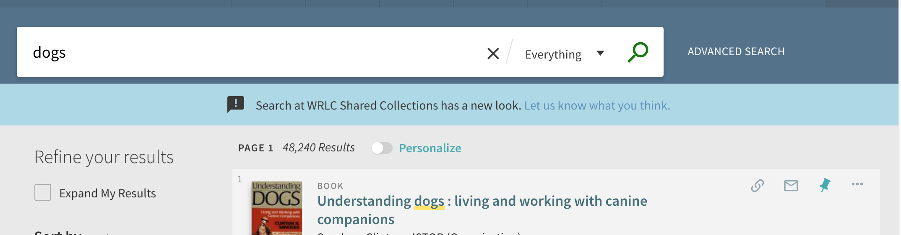

# primo-explore-wrlc-announce

## Description
Add an announcement bar underneath the search bar. This module was created as a demo to try adding an independent feature to Primo. Borrowed CSS to size the bar from [NYUs primo-explore-search-bar-sub-menu](https://github.com/nyulibraries/primo-explore-search-bar-sub-menu).

### Screenshot


## Install
1. Make sure you've installed and configured [primo-explore-devenv](https://github.com/ExLibrisGroup/primo-explore-devenv).
2. Navigate to your template/central package root directory. For example:
    ```
    cd primo-explore/custom/MY_VIEW_ID
    ```
3. If you do not already have a `package.json` file in this directory, create one:
    ```
    npm init -y
    ```
4. Install this package:
    ```
    npm install primo-explore-wrlc-announce --save-dev
    ```
## Usage
Once this package is installed, start up the primo-explore-devenv. This will collect the code and insert it into your view. After this is done, you'll need to add configuration to your custom.js file:

Add `wrlcAnnounce` as a dependency for your custom module definition.

```js
var app = angular.module('viewCustom', ['wrlcAnnounce'])
```
Configure your API calls to retrieve announcements. `primo-explore-wrlc-announce` has the following configuration options

| name | type | usage |
|---|---|---|
| `announceAPI`* | string | A url that can be used to fetch your announcement data. |
| `getShow`* | function | A function that returns TRUE if you want to show your announcement banner. |
| `getMessage`* | function | A function that returns the message text you want to display. |
| `getLink`* | function | A function that returns a link you want to add the the Message text. |
| `apiEntryNumber` | int | The id of the zero-indexed row you'd like information for (if you have multiple rows in your Google Sheet) |
| `getData` | function | A function that gets at the main data element shared by each of the following (defaulted to the raw 'response'.)|
| `getSeverity` | function | A function that returns the severity of the message (e.g. 'success', 'info', 'warn', 'alert') |

_note: options marked with an asterisk ('*') are required_

## Example

The following would be added to a secondary `custom.module.js` (or similarly named) file after the module is installed.

This example uses Google Sheets as the source for the announcement data.

```js
      //load app 'viewCustom' as a module with [] dependencies
      var app = angular.module('viewCustom', ['angularLoad', 'wrlcAnnounce']);

      // - helper code for announcement banner ['wrlcAnnounce'] - //
      app.constant('announceConfig', {

        // view/edit the values in google spreadsheets regular view by using the same 'SHEET_ID' in the following: (docs.google.com/spreadsheets/d/<SHEET_ID>/edit)
        announceAPI: 'https://spreadsheets.google.com/feeds/list/1dhGFCdOYlEG-DxkNs5F94WnHEmEIyTllQKhhWWtmmIE/1/public/values?alt=json',

        // specify which of the N 'entries' (rows) you want the info for [defaulted to 0]
        apiEntryNumber: 0,

        // get the main data object associated with your desired view
        getData: function(response) {
          return response.data.feed.entry[this.apiEntryNumber];
        },

        // obtain the specifically relevant parts of that data object
        getShow: function(data) {
          return data.gsx$showbanner.$t;
        },
        getMessage: function(data) {
          return data.gsx$messagetext.$t;
        },
        getLink: function(data) {
          return data.gsx$messagelink.$t;
        },
        getSeverity: function(data) {
          return data.gsx$messageseverity.$t;
        }
      });

```

## Setting up Google Sheets as the `announceAPI` data source

1. Create a new google sheet with the following general format:

|id |show_banner|message_severity|message_text|message_link|
|:--|:----------|:---------------|:-----------|:-----------|
|0  | TRUE | info | This is the first message text | http://thelink.com/1 |
|1  | FALSE| warn | An example of warning text | http://thelink.com/2 |
|2  | TRUE | success | You're getting it! (Hopefully) | http://theotherlink.com/3 |
|3  | TRUE | alert | If you're not, open up an issue and we'll help out! | https://github.com/wrlc-primo-dev/primo-explore-wrlc-announce/issues |

2. Go to 'File > Publish to the Web'. Select the relevant sheet and 'Web Page', then click publish. Copy and paste the link it shows you to make sure it works.

3. In your new `custom.module.js` file, set the `announceAPI` variable to match
  `'https://spreadsheets.google.com/feeds/list/<SHEET_ID>/1/public/values?alt=json'`
  replacing `<SHEET_ID>` with what's matching from the link at the top of your browser:
  `https://docs.google.com/spreadsheets/d/<SHEET_ID>/edit`
